<p align="center">
  
</p>

<p align="center">
  <a href="https://github.com/git-fabric/fabric-ctrl/releases"></a>
  <a href="https://github.com/git-fabric/fabric-ctrl/blob/main/LICENSE"></a>
  <a href="https://github.com/git-fabric"></a>
  <a href="docs/adr/ADR-0001-0004.md"></a>
</p>

---

`fabric-ctrl` is the lynchpin of the [git-fabric](https://github.com/git-fabric) ecosystem. It authenticates as a **GitHub App** — giving it a machine identity with scoped, short-lived tokens across every repo in the org. Everything flows through it: security events, Dependabot alerts, secret scanning, audit logs, and org-level MCP tooling.

It is **not** a proxy for the individual fabric app servers. Those handle their own domains (`unifi`, `proxmox`, `k8s`, `sandfly`, etc.). `fabric-ctrl` owns the **org layer** — the GitHub security surface and the control plane that sits above all of them.

---

## Architecture

<p align="center">
  
</p>

Two entrypoints, one identity:

| Entrypoint | Transport | Purpose |
|---|---|---|
| `src/mcp/index.ts` | stdio | MCP tools for org-level GitHub operations |
| `src/app/index.ts` | HTTP (Hono) | Webhook receiver for all org security events |

---

## Zero-Trust Posture

<p align="center">
  
</p>

See [`docs/adr/ADR-0001-0004.md`](docs/adr/ADR-0001-0004.md) for the full architectural rationale.

---

## Ecosystem

<p align="center">
  
</p>

`fabric-ctrl` does not proxy the individual app MCP servers. It owns the org layer. The individual apps own their infrastructure domains. The [gateway](https://github.com/git-fabric/gateway) handles routing between them.

---

## Setup

### 1. Register the GitHub App

Go to: `https://github.com/organizations/git-fabric/settings/apps/new`

**App name:** `fabric-security`
**Homepage URL:** `https://github.com/git-fabric/fabric-ctrl`
**Webhook URL:** Your public endpoint (e.g. `https://fabric-ctrl.yourdomain.com/webhooks/github`)
**Webhook secret:** Generate a strong random secret — you'll need it in `.env`

**Permissions:**

| Scope | Permission |
|---|---|
| Repository: Contents | Read |
| Repository: Issues | Read & Write |
| Repository: Pull requests | Read & Write |
| Repository: Security events | Read |
| Repository: Workflows | Read |
| Organization: Members | Read |
| Organization: Administration | Read |

**Subscribe to events:**
`push` `pull_request` `code_scanning_alert` `secret_scanning_alert` `repository_vulnerability_alert` `dependabot_alert` `member` `organization` `workflow_run`

### 2. Install the App on the org

After creating the App, install it on the `git-fabric` org. Note the **Installation ID** from the installation URL.

### 3. Download the private key

Generate and download the `.pem` private key from the App settings page. Place it at `./secrets/fabric-ctrl.pem` (gitignored).

### 4. Configure environment

```bash
cp .env.example .env
# populate all values
```

### 5. Install and run

```bash
npm install

# Webhook server
npm run dev:app

# MCP server (for Claude Desktop / git-steer)
npm run dev:mcp
```

---

## MCP Tools

| Tool | Description |
|---|---|
| `org__list_repos` | List all repos in the git-fabric org |
| `org__get_security_overview` | Open Dependabot, code scanning, and secret scanning alerts |
| `org__list_members` | List org members by role |
| `org__get_audit_log` | Fetch org audit log entries |

All tools use the App identity — no credentials accepted as input.

---

## Webhook Events

| Event | Handler | ZT Behavior |
|---|---|---|
| `push` | `push.ts` | Flags direct-to-main, sensitive path changes |
| `code_scanning_alert` | `security-alert.ts` | Escalates critical alerts immediately |
| `secret_scanning_alert` | `security-alert.ts` | Treats all detections as compromised |
| `repository_vulnerability_alert` | `security-alert.ts` | Routes to CVE triage pipeline |
| `dependabot_alert` | `dependabot.ts` | Escalates critical/high, queues medium/low |
| `member` | `audit.ts` | Logs all access grants |
| `organization` | `audit.ts` | Flags membership changes |
| `workflow_run` | `audit.ts` | Flags fork-triggered workflows |

---

## Project Structure

```
fabric-ctrl/
├── src/
│   ├── app/                          # GitHub App webhook server
│   │   ├── index.ts                  # Hono server, event dispatch
│   │   ├── auth.ts                   # App JWT + installation token
│   │   ├── handlers/                 # Typed event handlers
│   │   │   ├── push.ts
│   │   │   ├── security-alert.ts
│   │   │   ├── dependabot.ts
│   │   │   └── audit.ts
│   │   └── middleware/
│   │       └── verify-signature.ts   # HMAC-SHA256 webhook verification
│   └── mcp/                          # MCP server
│       ├── index.ts                  # stdio MCP server
│       └── tools/
│           └── org.ts                # org__* tools
├── docs/adr/                         # Architectural decision records
├── secrets/                          # gitignored — private key lives here
├── .env.example
├── mcp.json                          # Claude Desktop config
├── package.json
└── tsconfig.json
```

---

<p align="center">
  <sub>Built by <a href="https://github.com/ry-ops">ry-ops</a>. Part of <a href="https://github.com/git-fabric">git-fabric</a>.</sub>
</p>
