<p align="center">
  
</p>

<p align="center">
  <a href="https://github.com/git-fabric/fabric-ctrl/releases"></a>
  <a href="https://github.com/git-fabric/fabric-ctrl/blob/main/LICENSE"></a>
  <a href="https://github.com/git-fabric"></a>
  <a href="adr/ADR-0004-zero-trust-posture.md"></a>
</p>

---

`fabric-ctrl` is the lynchpin of the [git-fabric](https://github.com/git-fabric) ecosystem. It authenticates as a **GitHub App** — giving it a machine identity with scoped, short-lived tokens across every repo in the org. Everything flows through it: security events, Dependabot alerts, secret scanning, audit logs, and org-level MCP tooling.

It is **not** a proxy for the individual fabric app servers. Those handle their own domains (`unifi`, `proxmox`, `k8s`, `sandfly`, etc.). `fabric-ctrl` owns the **org layer** — the GitHub security surface and the control plane that sits above all of them.

---

## Architecture

<p align="center">
  
</p>

Two entrypoints, one identity:

| Entrypoint | Transport | Purpose |
|---|---|---|
| `src/mcp/index.ts` | stdio | MCP tools for org-level GitHub operations |
| `src/app/index.ts` | HTTP (Hono) | Webhook receiver for all org security events |

---

## Zero-Trust Posture

<p align="center">
  
</p>

The rationale is in fabric-ctrl's ADRs: [identity](adr/ADR-0001-github-app-identity.md), [webhook event bus](adr/ADR-0002-webhook-security-event-bus.md), [MCP control plane](adr/ADR-0003-mcp-org-control-plane.md) and [zero-trust posture](adr/ADR-0004-zero-trust-posture.md).

---

## Ecosystem

<p align="center">
  
</p>

`fabric-ctrl` does not proxy the individual app MCP servers. It owns the org layer. The individual apps own their infrastructure domains. The [gateway](https://github.com/git-fabric/gateway) handles routing between them.

---

## Ollama Inference Flow

<p align="center">
  
</p>

All inference stays local. Chat and Aiana use the shared Ollama instance running in the k3s cluster — no API tokens leave the network. `fabric-ctrl` routes tool calls to the appropriate fabric app, which hits the infrastructure directly.

---

## Setup

### 1. Register the GitHub App

Go to: `https://github.com/organizations/git-fabric/settings/apps/new`

**App name:** `fabric-security`
**Homepage URL:** `https://github.com/git-fabric/fabric-ctrl`
**Webhook URL:** Your public endpoint (e.g. `https://fabric-ctrl.yourdomain.com/webhooks/github`)
**Webhook secret:** Generate a strong random secret — you'll need it in `.env`

**Permissions:**

| Scope | Permission |
|---|---|
| Repository: Contents | Read |
| Repository: Issues | Read & Write |
| Repository: Pull requests | Read & Write |
| Repository: Security events | Read |
| Repository: Workflows | Read |
| Organization: Members | Read |
| Organization: Administration | Read |

**Subscribe to events:**
`push` `pull_request` `code_scanning_alert` `secret_scanning_alert` `repository_vulnerability_alert` `dependabot_alert` `member` `organization` `workflow_run`

### 2. Install the App on the org

After creating the App, install it on the `git-fabric` org. Note the **Installation ID** from the installation URL.

### 3. Download the private key

Generate and download the `.pem` private key from the App settings page. Place it at `./secrets/fabric-ctrl.pem` (gitignored).

### 4. Configure environment

```bash
cp .env.example .env
# populate all values
```

### 5. Install and run

```bash
npm install

# Webhook server
npm run dev:app

# MCP server (for Claude Desktop / git-steer)
npm run dev:mcp
```

---

## MCP Tools

| Tool | Description |
|---|---|
| `org__list_repos` | List all repos in the git-fabric org |
| `org__get_security_overview` | Open Dependabot, code scanning, and secret scanning alerts |
| `org__list_members` | List org members by role |
| `org__get_audit_log` | Fetch org audit log entries |

All tools use the App identity — no credentials accepted as input.

### Looking glass: `fabric_resolve`

Ask what the fabric can do for an intent without doing anything ([AI-ADR-013](https://github.com/git-fabric/adr/blob/main/docs/AI-ADR-013-fabric-resolve-looking-glass.md)). Read-only; it never executes a tool.

```json
{ "intent": "reboot the plex vm", "constraints": { "readOnly": false, "localOnly": false, "maxSteps": 8 } }
```

It answers with a verdict (`have`, `partial` or `missing`), an ordered plan, typed gaps and an escalation hint:

- **Plan:** each step names the app and tool, its effect (`read`, `write` or `destructive`, from the tool's MCP annotations), app health, credential scope, and whether a loaded fabric-llm model can run it locally.
- **Gaps:** `no_tool`, `app_down`, `stale_inventory`, `insufficient_scope`, `policy_denied` or `low_confidence`, each with a suggestion (`build_app`, `restore_app`, `grant_scope`, `improve_description`) and a signature that groups reworded intents.
- **Confidence:** below 0.6 the answer is advisory; plans that span apps are always advisory.

The inventory is built live from the apps loaded via `gateway.yaml` and refreshed every `RESOLVE_TTL_SECONDS / 2` (default TTL 300s). Matching is lexical for now; plan assembly is deterministic. `fabric_route` and `fabric_invoke` with `dry_run: true` return the same answer.

---

## Webhook Events

| Event | Handler | ZT Behavior |
|---|---|---|
| `push` | `push.ts` | Flags direct-to-main, sensitive path changes |
| `code_scanning_alert` | `security-alert.ts` | Escalates critical alerts immediately |
| `secret_scanning_alert` | `security-alert.ts` | Treats all detections as compromised |
| `repository_vulnerability_alert` | `security-alert.ts` | Routes to CVE triage pipeline |
| `dependabot_alert` | `dependabot.ts` | Escalates critical/high, queues medium/low |
| `member` | `audit.ts` | Logs all access grants |
| `organization` | `audit.ts` | Flags membership changes |
| `workflow_run` | `audit.ts` | Flags fork-triggered workflows |

---

## Upcoming

What is left after `fabric_resolve` phase 1, roughly in order:

**`fabric_resolve` (AI-ADR-013)**
- [ ] **Tool-level sequence templates:** rewrite SEQ-01…06 (`src/invoke/sequences.ts`) as tool-level `TEMPLATES` in `src/resolve/plan.ts`. They name specialist models today, not tools.
- [ ] **Apps that fail to load show as `app_down`:** an app whose `createApp()` throws (e.g. aiana without `QDRANT_API_KEY`) is missing from the inventory, so its intents answer `no_tool` instead of `app_down`.
- [ ] **Gap backlog:** persist gap signatures with counts and hand recurring ones to git-steer as build issues.
- [ ] **Credential scope:** apps declare `requiredScopes` per tool so plans report `ok` or `insufficient` instead of `unknown`.
- [ ] **Caller policy:** per-caller limits beyond the `readOnly` and `localOnly` constraints.

**Phase 2**
- [ ] **F-RIB inventory:** read capabilities from the `@fabric-sdk/gateway` route reflector once it is deployed, alongside the in-process registry.
- [ ] **Semantic matcher:** swap the lexical matcher for Qdrant embeddings behind the same `Matcher` interface.

**Housekeeping**
- [ ] `org__get_security_overview` accepts a `repo` filter but ignores it.
- [ ] Add `fabric-review`'s tool-contract rule to PR checks, so unannotated tools are caught before merge.
- [ ] Merge or close the pending `chore: sync global ADRs` PR (#22; its commit is unsigned, so it needs a signed re-push).

---

## Project Structure

```
fabric-ctrl/
├── src/
│   ├── app/                          # GitHub App webhook server
│   │   ├── index.ts                  # Hono server, event dispatch
│   │   ├── auth.ts                   # App JWT + installation token
│   │   ├── dispatch.ts               # Fabric app tool dispatch
│   │   ├── audit-log.ts              # Audit log persistence
│   │   ├── notify.ts                 # Outbound webhook notifications
│   │   ├── handlers/                 # Typed event handlers
│   │   │   ├── push.ts
│   │   │   ├── security-alert.ts
│   │   │   ├── dependabot.ts
│   │   │   └── audit.ts
│   │   └── middleware/
│   │       └── verify-signature.ts   # HMAC-SHA256 webhook verification
│   ├── invoke/                       # fabric-invoke: router, sequences, Aiana
│   ├── resolve/                      # fabric.resolve looking glass (AI-ADR-013)
│   └── mcp/                          # MCP server
│       ├── index.ts                  # stdio MCP server
│       ├── loader.ts                 # Loads fabric apps from gateway.yaml
│       └── tools/
│           └── org.ts                # org__* tools
├── adr/
│   ├── global/                       # Org-wide ADRs, synced from git-fabric/adr
│   └── ADR-000N-*.md                 # fabric-ctrl ADRs, one per decision
├── docs/images/                      # README diagrams
├── scripts/
│   └── ollama-load.sh                # Load fabric vLLM Modelfiles into Ollama
├── secrets/                          # gitignored — private key lives here
├── .env.example
├── gateway.yaml                      # Fabric app manifest
├── mcp.json                          # Claude Desktop config
├── Dockerfile
├── package.json
└── tsconfig.json
```

---

<p align="center">
  <sub>Built by <a href="https://github.com/ry-ops">ry-ops</a>. Part of <a href="https://github.com/git-fabric">git-fabric</a>.</sub>
</p>

<!-- org-footer -->
---

<p align="center"><sub>Part of <a href="https://github.com/git-fabric">git-fabric</a> · composable fabric apps for Git-native infrastructure · built by <a href="https://github.com/ry-ops">ry-ops</a></sub></p>
